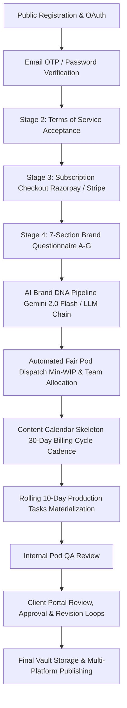
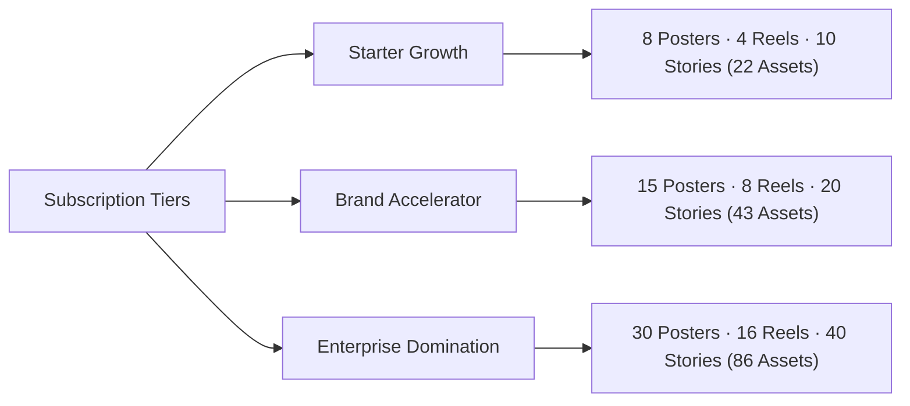
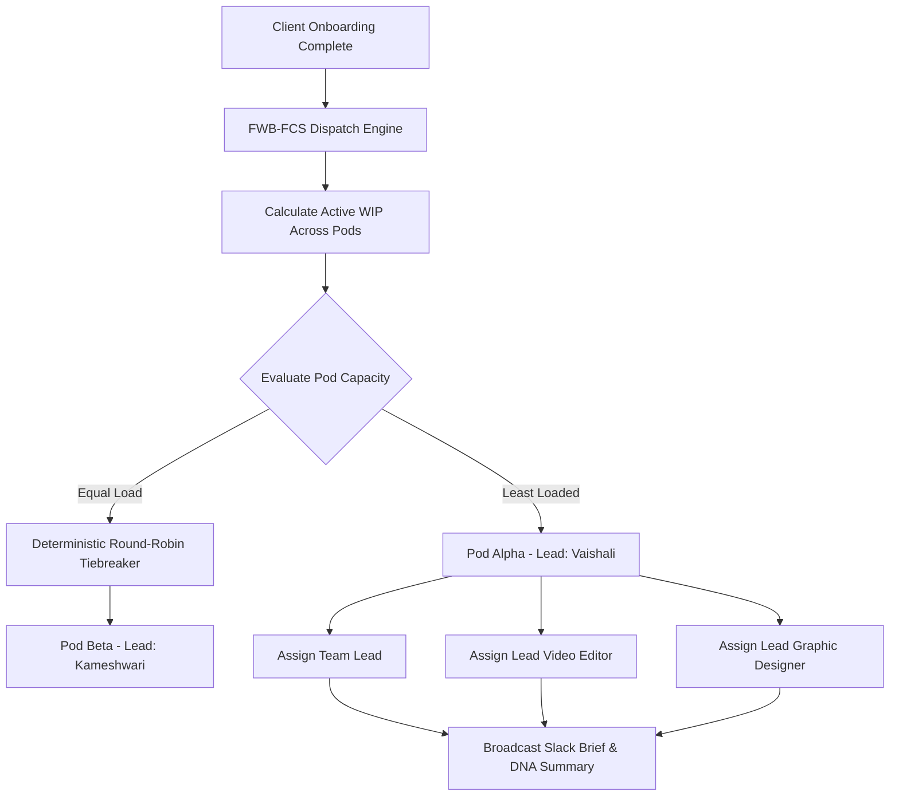
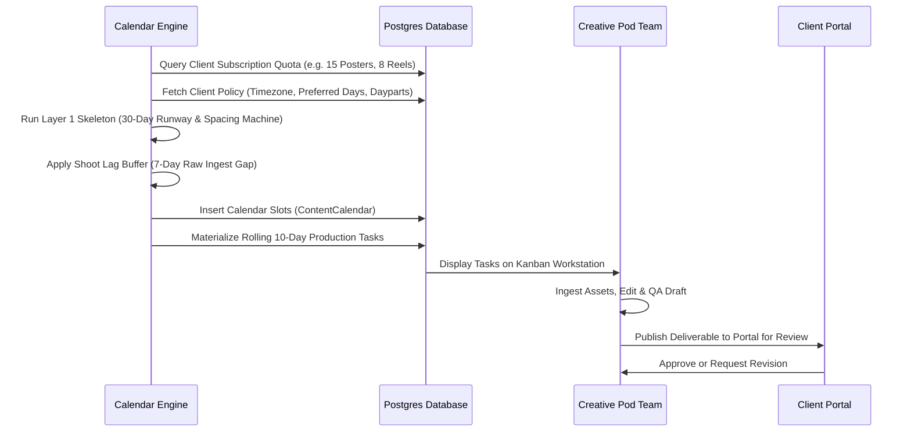
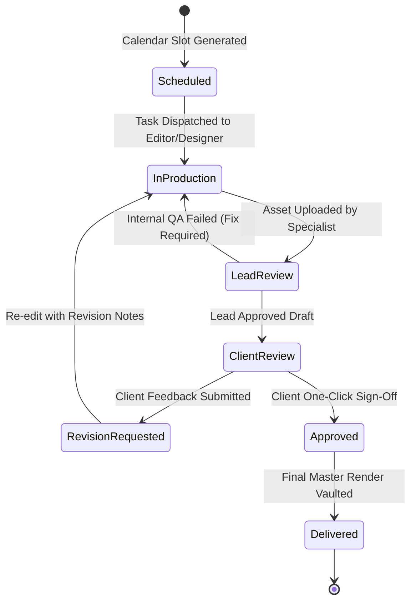

# CREO™ Platform — End-to-End Client Onboarding & Content Production Workflow Guide

> **Authoritative Technical & Operational Reference Manual**  
> **System Architecture**: Multi-Tenant Content Production SaaS  
> **Target Audience**: Product Managers, Operations Leads, Creative Pod Leads, Developers, and Client Success Managers

---

## Table of Contents
1. [Executive Overview & Core Architecture](#1-executive-overview--core-architecture)
2. [Phase 1: Registration, Verification & Terms Acceptance](#2-phase-1-registration-verification--terms-acceptance)
3. [Phase 2: Subscription Plans, Pricing & Checkout](#3-phase-2-subscription-plans-pricing--checkout)
4. [Phase 3: The 7-Section Deep-Dive Brand Questionnaire](#4-phase-3-the-7-section-deep-dive-brand-questionnaire)
5. [Phase 4: AI Brand DNA Synthesis Engine](#5-phase-4-ai-brand-dna-synthesis-engine)
6. [Phase 5: Automated Team Allocation & Pod Dispatch Engine](#6-phase-5-automated-team-allocation--pod-dispatch-engine)
7. [Phase 6: Multi-Layer Content Calendar Engine](#7-phase-6-multi-layer-content-calendar-engine)
8. [Phase 7: Production Task Board & Deliverable Lifecycle](#8-phase-7-production-task-board--deliverable-lifecycle)
9. [Database Models & API Route Mapping Reference](#9-database-models--api-route-mapping-reference)

---

## 1. Executive Overview & Core Architecture

CREO is an enterprise-grade automated content production engine connecting high-growth brands with specialized Creative Pods (Lead, Video Editor, Graphic Designer). The platform replaces agency chaos with a mathematically deterministic, SLA-guaranteed production pipeline.



### Derived Onboarding Stage Machine
The onboarding pipeline enforces a strict, derived progress state machine backed by PostgreSQL database view `v_client_onboarding`. Clients cannot bypass stages via API parameter tampering:

| Stage Index | Stage Name | Prerequisite Condition Enforced by DB View |
| :---: | :--- | :--- |
| **0** | `Account Registered` | User record created in `users` table. |
| **1** | `Account Verified` | Email confirmed via OTP or Google OAuth handshake. |
| **2** | `Terms Accepted` | `terms_accepted_at` timestamp recorded in `client_profiles`. |
| **3** | `Subscription Active` | Valid row in `subscriptions` with `status = 'active'`. |
| **4** | `Questionnaire Submitted` | Core sections A through E filled and saved in `questionnaires`. |
| **5** | `Onboarding Complete` | Pod assigned, Brand DNA generated, 30-day calendar live. |

---

## 2. Phase 1: Registration, Verification & Terms Acceptance

### 1. Account Creation
- **Options**:
  1. **Password Authentication**: Email + Password with client-side & server-side regex validation.
  2. **Zero-Friction Google OAuth 2.0**: Single-click authorization via Google Identity Services (`/api/v1/auth/google/url` $\to$ `/api/v1/auth/google/callback`).
  3. **Passwordless Email OTP**: 6-digit cryptographic OTP valid for 10 minutes with rate-limiting (max 5 requests per 15 minutes).

### 2. Terms of Service & Master Service Agreement (Stage 2)
- **Component**: `StageTerms.tsx`
- **API Endpoint**: `POST /api/v1/onboarding/terms`
- **Payload**: `{"terms_version": "2026-v2.1"}`
- **Legal Safeguards**:
  - Mutual non-disclosure agreement (NDA) protecting client trade secrets and brand assets.
  - IP ownership assignment: Client owns 100% of final rendered deliverables upon cleared payment.
  - Production SLA & Revision limits based on chosen subscription tier.

---

## 3. Phase 2: Subscription Plans, Pricing & Checkout



### Subscription Tiers & Output Quotas

CREO offers three distinct monthly subscription tiers configured in `backend/app/services/calendar_engine.py`:

| Deliverable Attribute | Starter Growth (`starter`) | Brand Accelerator (`accelerator`) | Enterprise Domination (`enterprise`) |
| :--- | :---: | :---: | :---: |
| **Price (INR / Mo)** | ₹25,000 | ₹50,000 | ₹95,000 |
| **Price (USD / Mo)** | $1,500 | $3,000 | $6,000 |
| **Reels / Short-Form Videos** | **4** / mo | **8** / mo | **16** / mo |
| **Posters / Carousel Decks** | **8** / mo | **15** / mo | **30** / mo |
| **Stories & Micro-Graphics** | **10** / mo | **20** / mo | **40** / mo |
| **Total Deliverables per Cycle** | **22 Deliverables** | **43 Deliverables** | **86 Deliverables** |
| **Revision Rounds per Asset** | 1 Round | 2 Rounds | 3 Rounds (Priority QA) |
| **Shoot Days per Cycle** | 1 Shoot Day | 1 Shoot Day | 2 Shoot Days |
| **Dedicated Creative Director** | Shared Oversight | Dedicated Director | Dedicated Director + Strategist |
| **Turnaround SLA** | 72 Hours | 48 Hours | 24 Hours (Express Dispatch) |

### Payment Gateway Architecture
- **Dual Gateway Support**:
  1. **Razorpay (India / UPI / RuPay / Cards / NetBanking)**:
     - Server initializes order via `createOrder(userId, planId, "razorpay")`.
     - Client loads dynamic SDK (`loadRazorpayScript` on-demand) and invokes `openRazorpayCheckout()`.
     - Webhook receives `payment.captured` $\to$ activates subscription row in `subscriptions`.
  2. **Stripe (International / Global Cards / ACH)**:
     - Server creates Stripe Checkout Session $\to$ redirects client or embeds Elements.
     - Webhook receives `checkout.session.completed` $\to$ activates subscription.

---

## 4. Phase 3: The 7-Section Deep-Dive Brand Questionnaire

Once payment clears, the client enters **Stage 4** in `StageQuestionnaire.tsx`. The questionnaire captures all structural parameters needed to automate creative generation without endless meetings.

```
       Section A: Brand Foundation & Identity
                         │
       Section B: Target Audience & Positioning
                         │
       Section C: Brand Voice & Persona Sliders
                         │
       Section D: Visual Direction & Aesthetics
                         │
       Section E: Production Logistics & Shoots
                         │
  ──────────────── Core Completion Barrier ──────────────── (Unlocks Team Dispatch)
                         │
       Section F: Past Content Post-Mortem
                         │
       Section G: Origin, Legacy & Long-term Vision
```

### Breakdown of Sections:

#### Section A: Brand Foundation & Identity
- **Brand Name & Instagram Handle**: Official registered moniker and primary social presence.
- **One-Liner Hook**: Crisp 1-sentence value proposition ("Who you help and how").
- **Industry Category**: e.g., Direct-to-Consumer, B2B SaaS, Health & Wellness, FinTech, Fashion.
- **Core Offerings / Hero Products**: The 1-3 primary revenue drivers to prioritize.
- **Primary Goal**: Brand Awareness, Customer Acquisition, Community Engagement, or Thought Leadership.

#### Section B: Target Audience & Positioning
- **Ideal Customer Profile (ICP)**: Age, gender, profession, income bracket, aspirations.
- **Primary Problem Solved**: The emotional or logistical pain point the client solves.
- **Why Chosen (Differentiators)**: Why customers buy from them over competitors.
- **Key Buyer Objections**: Common hesitation points (price, trust, efficacy) to debunk in scripts.
- **Primary Competitors**: 2-4 competitor handles for benchmarking.

#### Section C: Brand Voice & Persona Sliders
- **Interactive Nuance Sliders (1 to 10 Scale)**:
  - *Humour*: 1 (Deadpan Corporate) $\longleftrightarrow$ 10 (Meme-Centric & Witty)
  - *Formality*: 1 (Casual Slang & Gen-Z) $\longleftrightarrow$ 10 (Academic & Regal)
  - *Respectfulness*: 1 (Provocative Contrarian) $\longleftrightarrow$ 10 (Polite & Reassuring)
  - *Energy*: 1 (Zen & Minimalist) $\longleftrightarrow$ 10 (High-Octane Fast Cuts)
- **Voice Adjectives (Allowlist)**: e.g., `["Bold", "Authoritative", "Empathetic", "Direct"]`.
- **Anti-Voice Words (Strict Prohibitions)**: Words the brand refuses to embody (e.g., `["Corporate", "Preachy", "Cheap", "Cringe"]`).
- **Forbidden Phrases (Taboos)**: Exact phrases never to be uttered in captions or scripts.

#### Section D: Visual Direction & Aesthetics
- **Hex Color Palette**: Primary (`#0D2137`), Accent (`#2B7BC4`), Neutral (`#F8FAFC`).
- **Typography Guidelines**: Heading font, body font, typographic hierarchy.
- **Visual Direction Style**: Clean Minimalist, Dark Cinema, Vibrant Pop, or Typography-Heavy.
- **Visual Avoidances**: No stock photography, no AI hallucinations, no cluttered graphics.

#### Section E: Production Logistics & Shoots
- **On-Camera Talent**: Founder, In-house team, Professional Actors, or Faceless/Voiceover.
- **Founder Camera Comfort**: `yes_confident`, `needs_scripting`, or `voiceover_only`.
- **Shoot Location Preference**: Client Office/Store, Studio Set, Outdoor Lifestyle.
- **Sample Logistics**: Whether physical products are shipped to the studio.
- **Format Exclusions**: Formats the brand specifically opts out of (e.g. dancing trends).

#### Section F: Past Content Post-Mortem (Extended)
- **Historical Top Posts**: What previously generated high engagement and why.
- **What Failed**: Angles, hooks, or styles that fell flat.

#### Section G: Origin, Legacy & Long-term Vision (Extended)
- **Origin Story**: Why the founder started the company.
- **Core Beliefs**: What the brand stands for and what it will never compromise on.
- **Legacy**: What the brand wants to be remembered for in 10 years.

---

## 5. Phase 4: AI Brand DNA Synthesis Engine

Once Section E is submitted, the backend triggers `run_brand_dna_pipeline(db, client_id)` in `backend/app/services/brand_dna.py`.

### 3-Tier Resilient Fallback Architecture
1. **Tier 1 — Gemini 2.0 Flash / 1.5 Flash**: Strict JSON mode with structured schema validation.
2. **Tier 2 — OpenAI GPT-4o-mini Fallback**: Automatically called if Gemini returns rate limits or downtime.
3. **Tier 3 — Deterministic Python Generator**: Guaranteed execution directly from Sections A-E inputs. The client **never** encounters a failure.

### Strict Prompt-Injection & PII Defense
Before any prompt is sent to an external LLM, `sanitize_for_llm()` scrubs:
- Raw social media handles and phone numbers.
- Unsanitized URL query parameters and storage tokens.
- Private billing details or payment IDs.

### Verbatim Hard Constraint Assembler (`assemble_do_not`)
The AI model is **never** trusted to summarize away legal or negative constraints. A specialized Python compiler aggregates verbatim prohibitions into a permanent guardrail list:
```python
do_not = [
    "Never sound corporate or pushy",
    "Never use the word 'cheap' or 'affordable'",
    "Never show unbranded packaging",
    "Never make unverified medical claims"
]
```

### Brand DNA Output Structure
The synthesized Brand DNA document contains:
- **Executive Positioning**: The definitive brand narrative.
- **Target Audience Personas**: Primary buyer psychology and emotional triggers.
- **4 Core Content Pillars**:
  1. *Authority & Credibility* (Educational breakdowns, teardowns, industry analysis).
  2. *Product Showcase & Social Proof* (Case studies, transformations, demos).
  3. *Brand Story & Culture* (Founder philosophy, behind-the-scenes).
  4. *Engagement & Community* (Actionable challenges, questions, debates).
- **Audio-Visual Directives**: Cut frequency (BPM), typography styling, color grading presets.

---

## 6. Phase 5: Automated Team Allocation & Pod Dispatch Engine

CREO distributes production across independent **Creative Pods** using the **Fair Workload-Balanced Pod Dispatch & Feasible Cadence Scheduler (FWB-FCS)** implemented in `backend/app/services/fair_dispatch_service.py` and `dispatch_engine.py`.



### The Creative Pod Roster Structure

Each Creative Pod is an autonomous unit comprising 3 core specialized roles:

1. **Pod Team Lead & Account Director**:
   - Manages client communications, review cycles, and calendar sign-off.
   - Enforces internal QA before any draft is visible to the client.
   - Monitors deliverable SLAs and capacity headroom.
2. **Lead Video Editor (Reels & Motion)**:
   - Owns raw footage ingest, sound design, color grading, subtitles, and vertical hooks.
3. **Lead Graphic Designer (Posters & Carousels)**:
   - Owns typography, multi-slide educational carousels, ad creatives, and cover art.

### Impartial Min-WIP Allocation Algorithm
- **Work-In-Progress (WIP) Metric**: Evaluates the number of active retainers assigned to each Pod Lead.
- **Capacity Headroom**: Ensures no individual editor or designer exceeds 80% daily capacity caps.
- **Automated Handshake Broadcast**:
  Upon assignment, `notify_team_of_new_client_summary()` executes:
  - Creates in-app notifications for Pod Lead, Editor, and Designer.
  - Generates the executive onboarding summary brief.
  - Sends webhooks to the dedicated Pod Slack Channel (`#pod-alpha` or `#pod-beta`) containing the brand positioning, asset drive links, and subscription quota.

---

## 7. Phase 6: Multi-Layer Content Calendar Engine

CREO’s Content Calendar Engine (`backend/app/services/calendar_engine.py`) generates a deterministic 30-day posting calendar.



### The Three-Layer Calendar Generation Architecture

#### Layer 1: Deterministic Skeleton (The Spacing Machine)
- **Cycle Duration**: Standard 30-day rolling cycle beginning on subscription activation.
- **Shoot Day Lag Buffer**:
  - Raw footage requires ingest and cataloging. Reels are held back by a minimum 7-day buffer (`reel_lag_days = 7`) post-shoot to prevent bottleneck panics.
- **Spacing Invariants**:
  - No two Reels can ever be scheduled on the same calendar day.
  - Minimum 24 hours between high-production video assets.
  - Posters and stories distributed to fill gaps between video days.

#### Layer 2: Per-Client Policy & Dayparts
- Client preferences configured in JSONB policy (`calendar_policies`):
  - **Preferred Days of Week (`preferred_dows`)**:
    - Reels: Tuesday, Wednesday, Thursday (Peak discovery days).
    - Posters: Monday, Wednesday, Friday (Professional feed hours).
    - Stories: Daily cadence across all 7 days.
  - **Peak Dayparts (Client Timezone)**:
    - *Morning*: 11:00 AM (Stories / Announcements)
    - *Afternoon*: 1:00 PM (Educational Carousels / Posters)
    - *Evening Peak*: 7:30 PM (High-Retention Reels)
  - **Calendar Blackouts**: Holidays, product blackout windows, and corporate freezes automatically skipped.

#### Layer 3: Rolling 10-Day Task Materialization
- The engine does not dump 90 unmanageable tasks at once into the team queue.
- Instead, it materializes tasks in a **rolling 10-day production window**:
  - Slot date $T$ generates production task at $T - 5$ business days.
  - Video Editor receives task notification 5 days prior to target post date.
  - Deliverable reaches Lead QA 48 hours prior to post date.
  - Deliverable arrives in Client Review Portal 24 hours prior to post date.

---

## 8. Phase 7: Production Task Board & Deliverable Lifecycle

### The 6-Stage Deliverable State Machine



### Step-by-Step Deliverable Lifecycle

1. **Scheduled**: Slot created on calendar with title, content pillar, objective, and reference format.
2. **In Production**:
   - Specialist picks up task in `MemberTaskBoardPage.tsx`.
   - Checks brand palette, typography, and do-not guardrails from the Brand DNA widget.
   - Uploads high-res draft preview (MP4 / PNG / PDF).
3. **Internal Lead Review (`PodDeliverablesReviewPage.tsx`)**:
   - Pod Lead audits draft against Brand DNA, technical specs, audio volume, and spelling.
   - Rejects back to specialist if substandard; passes to client if approved.
4. **Client Review (`PortalDeliverablesPage.tsx`)**:
   - Client views streaming preview, caption copy, and scheduled posting time.
   - **Action A: One-Click Approval**: Deliverable moves immediately to `Approved`.
   - **Action B: Request Revision**:
     - Client enters timestamped notes or visual feedback in `RevisionDialog.tsx`.
     - System increments revision count against plan limit.
     - Specialist is alerted with exact feedback to re-edit.
5. **Final Delivery**:
   - Master files stored in Cloudflare / AWS S3 storage.
   - Downloadable in full fidelity or auto-syndicated.

---

## 9. Database Models & API Route Mapping Reference

### Key Backend Models
- `users`: Core authentication identity, role (`client`, `team_lead`, `team_member`, `admin`), status.
- `client_profiles`: Company name, Instagram handle, Brand DNA JSON, onboarding timestamps, SLA deadlines.
- `subscriptions`: Active subscription, plan tier ID, billing cycle start/end dates, renewal status.
- `questionnaires`: 7-section structured answers (`section_a` through `section_g`), raw JSON, completion flags.
- `client_assignments`: Many-to-many relationship linking Clients to Pod Leads, Editors, and Designers.
- `content_calendars`: Individual calendar slots (post date, daypart, slot kind: reel/poster/story, status).
- `deliverables`: Rendered asset files, version histories, client revision feedback logs, approval stamps.
- `tasks`: Actionable production work items dispatched to specialists on the Kanban board.

### Comprehensive API Route Matrix

| Route | HTTP Method | Protected Roles | Functional Purpose |
| :--- | :---: | :--- | :--- |
| `/api/v1/auth/login` | `POST` | Public | Authenticates credentials and returns JWT bearer session. |
| `/api/v1/auth/google/callback` | `POST` | Public | Exchanges Google OAuth code for authenticated user session. |
| `/api/v1/onboarding/status` | `GET` | Client, Staff | Queries derived stage (0..5), checklist, and assigned pod. |
| `/api/v1/onboarding/terms` | `POST` | Client | Signs and records Master Service Agreement acceptance. |
| `/api/v1/onboarding/questionnaire` | `GET` / `POST` | Client, Staff | Autosaves or submits 7-section brand intelligence answers. |
| `/api/v1/onboarding/complete` | `POST` | Client, Staff | Finalizes stage 5, allocates pod, and triggers calendar build. |
| `/api/v1/brand-dna/:clientId` | `GET` | Client, Staff | Returns AI Brand DNA synthesis, positioning, and pillars. |
| `/api/v1/calendar/:clientId` | `GET` | Client, Staff | Returns monthly 30-day scheduled slots and publication times. |
| `/api/v1/deliverables` | `GET` / `POST` | Client, Staff | Lists active deliverables, streams previews, records revisions. |
| `/api/v1/deliverables/:id/approve` | `POST` | Client, Admin | One-click client sign-off and approval confirmation. |
| `/api/v1/deliverables/:id/revision`| `POST` | Client, Admin | Submits revision feedback within plan quota limits. |

---

*Document Version: 2.4.0 • Updated: September 2026 • CREO Platform Engineering & Operations*
